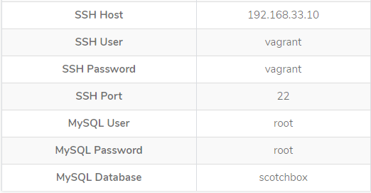
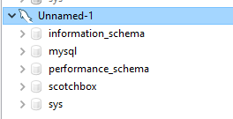

Why we don't like XAMPP

- Shipped with its unchangeable php version
- Hard to work on multiple project requiring different php version
- Every devs dont share the same dev env
- Cant be share/distribute between devs
- xdebug act very weird on xampp sometime

## Requirements

You need multiple tools on your machine

- VirtualBox( prefered) but can work with VMware too (https://www.virtualbox.org/)
- Vagrant (which is a wrapper to virtual box/vmware) https://www.vagrantup.com/
- HeidiSQL\* (free mysql client not as heavy as workbench) https://www.heidisql.com/download.php
- Git\* (https://git-scm.com/book/en/v2/Getting-Started-Installing-Git)
- Putty (https://www.putty.org/)
  \*optional

**What it will give you?**
Ability to download and launch on the fly different machines containing all the environment you need pre-setup

For example on my machine right now i have two boxes (LAMP env)


> Warning: Before you start make sure you shut down any running instance of XAMPP

This tuto is using scotch/box because it appears to be the most downloaded and easy one to setup


## Steps:

- Install all the tools above
- Create a folder where you are going to put work on your project (ex: c:\MyPhpProjects)
- Navigate to that folder via cmd and enter the following command (my project being the name of the project ex: learnsphere)

```
git clone https://github.com/scotch-io/scotch-box my-project
```

- Navigate into your new folder


```
vagrant up
```

- This should take a little while (it actually download the box for you and starting it)

- To have any realtime feedback you can open your virtual box and you should see your machine being added and running

- 

* If everything works you should be able to navigate to http://192.168.33.10

- You have now a full LAMP/LEMP stack running on your machine
- Navigate to your folder and you will see different docs and config files (all your project files goes into public you will work into that)


## Connection to MySQL

**Step**

- Open HeidiSQl (indicate your putty path for ssh)


- 

Then you can create db and do whatever you want



Usefull links:
https://box.scotch.io/docs/ (box the tuto was based from)
https://app.vagrantup.com/boxes/search (all the possible boxes available to us)
https://www.vagrantup.com/docs/cli/ (vagrant command)
